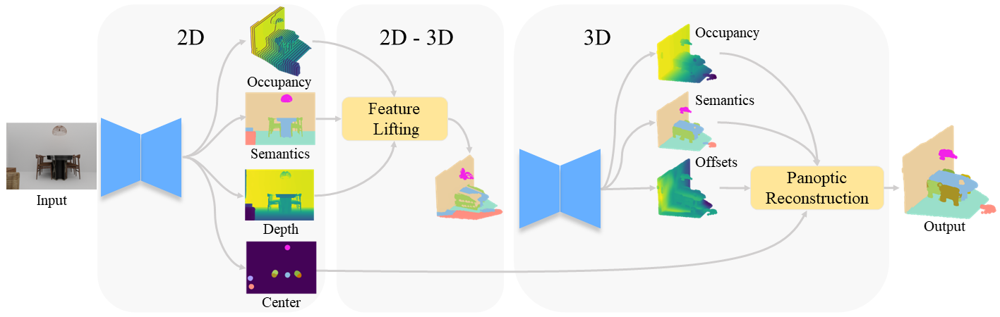

# BUOL: A Bottom-Up Framework with Occupancy-aware Lifting for Panoptic 3D Scene Reconstruction From A Single Image

## Introduction
This is an official release of the paper **BUOL: A Bottom-Up Framework with Occupancy-aware Lifting
for Panoptic 3D Scene Reconstruction From A Single Image**

> BUOL: A Bottom-Up Framework with Occupancy-aware Lifting for Panoptic 3D Scene Reconstruction From A Single Image    
> Tao Chu, [Pan Zhang](https://panzhang0212.github.io/), Qiong Liu, [Jiaqi Wang](https://myownskyw7.github.io/)      
> The IEEE / CVF Computer Vision and Pattern Recognition Conference (CVPR 2023)

<p align="left">
    
</p>

## Results

The results of BUOL on each dataset are shown below. We have released the models.

|   dataset    |  PRQ  |  RSQ  |  RRQ   | PRQ_th | PRQ_st |                                                Download                                                |
|:------------:|:-----:|:-----:|:------:|:------:|:------:|:------------------------------------------------------------------------------------------------------:|
|   3D FRONT   | 54.05 | 63.72 | 83.14  | 49.77  | 73.34  |   [front3d.pth](https://drive.google.com/file/d/1DoRIc5-iMQNixTJ8EQc2h8VCb8NgEc6_/view?usp=sharing)    |
| Matterport3D | 14.54 | 45.91 | 31.08  | 11.02  | 25.09  | [matterport3d.pth](https://drive.google.com/file/d/1Ph0QGVgq_bYrugQdcVzDwotRf8IIBZ0W/view?usp=sharing) |

<p align="left">
    
</p>

## Installation

Creat environment.
```bash
conda create -n buol -y
conda activate buol
conda install pytorch==1.8.0 torchvision==0.9.0 torchaudio==0.8.0 cudatoolkit=11.1 -c pytorch -c conda-forge -y
```


Install MinkowskiEngine.
```bash
git clone https://github.com/NVIDIA/MinkowskiEngine.git
cd MinkowskiEngine
python setup.py install --blas_include_dirs=${CONDA_PREFIX}/include --blas=openblas --force_cuda
```

Install PyMarchingCubes.
```bash
git clone https://github.com/xheon/PyMarchingCubes.git
cd PyMarchingCubes
git clone https://gitlab.com/libeigen/eigen.git
python setup.py install
```

Install other dependency packages.
```bash
pip install yacs fvcore
pip install opencv-python
conda install -c conda-forge openexr-python -y
pip install pyexr
pip install matplotlib
pip install plyfile
pip install loguru
```

## Run
Download [front3d.pth](https://drive.google.com/file/d/1DoRIc5-iMQNixTJ8EQc2h8VCb8NgEc6_/view?usp=sharing)
and put it at `models/front3d.pth`, and run:
```bash
python demo.py
```

Download datasets and put them in `datasets/<dataset_name>` as the following structure,
and then set GPUS (e.g. `GPUS: (0, 1, 2, 3)`) and `MODEL.EVAL: False` in the config file,
and train with multi-GPU:
```bash
python -m torch.distributed.launch --nproc_per_node=4 main.py --cfg configs/front.yaml
```

Download the model or train the model, and then set `MODEL.WEIGHTS` as the model path.
Set `GPUS: (0,)` and `MODEL.EVAL: True` in the config file, and test with one GPU:
```bash
python main.py --cfg configs/front.yaml
```

## Datasets

### 3D FRONT
The [3D FRONT](https://tianchi.aliyun.com/specials/promotion/alibaba-3d-scene-dataset) is a synthetic indoor dataset.
We process it the same as Dahnert et al. (Panoptic 3D Scene Reconstruction from a Single RGB Image).
You can download or process it from [there](https://github.com/xheon/panoptic-reconstruction).

#### Structure
```
front3d/
    <scene_id>/            
        ├── rgb_<frame_id>.png                  # Color image: 320x240x3
        ├── depth_<frame_id>.exr                # Depth image: 320x240x1
        ├── segmap_<frame_id>.mapped.npz        # 2D Segmentation: 320x240x2, with 0: pre-mapped semantics, 1: instances
        ├── geometry_<frame_id>.npz             # 3D Geometry: 256x256x256x1, truncated, (unsigned) distance field at 3cm voxel resolution and 12 voxel truncation.
        ├── segmentation_<frame_id>.mapped.npz  # 3D Segmentation: 256x256x256x2, with 0: pre-mapped semantics & instances
        ├── weighting_<frame_id>.mapped.npz     # 3D Weighting mask: 256x256x256x1
```

### Matterport3D
The [Matterport3D](https://niessner.github.io/Matterport/) is a real-world indoor datasets. We follow
Dahnert et al. to preprocess this dataset.
In addition, we generate [depth](https://drive.google.com/file/d/15xjRFmIk8vY089kveoZ4HM-6Ib0QhVRr/view?usp=sharing)
and [room mask](https://drive.google.com/file/d/1inOxqPge-DI5cmXBho8EtF1nPL0CTqKX/view?usp=sharing) by
rendering 3D scenes instead of using the origin version.

#### Structure
```
matterport/
    <scene_id>/            
        ├── <image_id>_i<frame_id>.png                    # Color image: 320x240x3
        ├── <image_id>_segmap<frame_id>.mapped.npz        # 2D Segmentation: 320x240x2, with 0: pre-mapped semantics, 1: instances
        ├── <image_id>_intrinsics_<camera_id>.png         # Intrinsics matrix: 4x4
        ├── <image_id>_geometry<frame_id>.npz             # 3D Geometry: 256x256x256x1, truncated, (unsigned) distance field at 3cm voxel resolution and 12 voxel truncation.
        ├── <image_id>_segmentation<frame_id>.mapped.npz  # 3D Segmentation: 256x256x256x2, with 0: pre-mapped semantics & instances
        ├── <image_id>_weighting<frame_id>.npz            # 3D Weighting mask: 256x256x256x1
matterport_depth_gen/
    <scene_id>/     
        ├── <posithion_id>_d<frame_id>.png                # Depth image: 320x240x1
matterport_room_mask/
    <scene_id>/   
        ├── <posithion_id>_rm<frame_id>.png               # room mask: 320x240x1


```


## Citation

```bibtex
@inproceedings{chu2023buol,
  title={BUOL: A Bottom-Up Framework With Occupancy-Aware Lifting for Panoptic 3D Scene Reconstruction From a Single Image},
  author={Chu, Tao and Zhang, Pan and Liu, Qiong and Wang, Jiaqi},
  booktitle={Proceedings of the IEEE/CVF Conference on Computer Vision and Pattern Recognition},
  pages={4937--4946},
  year={2023}
}
```


